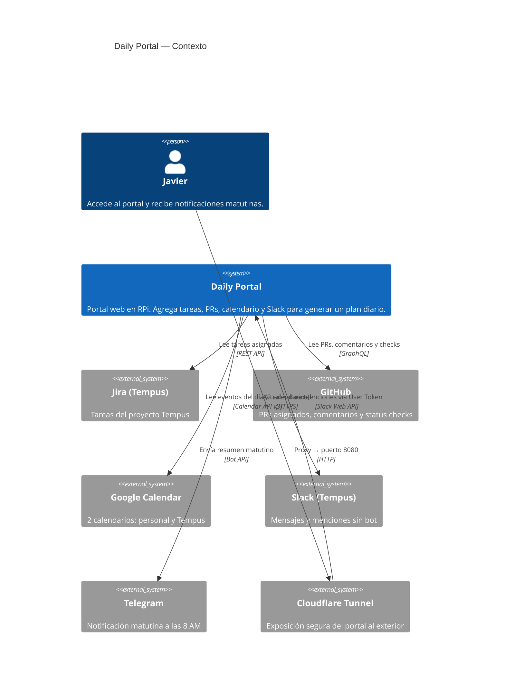
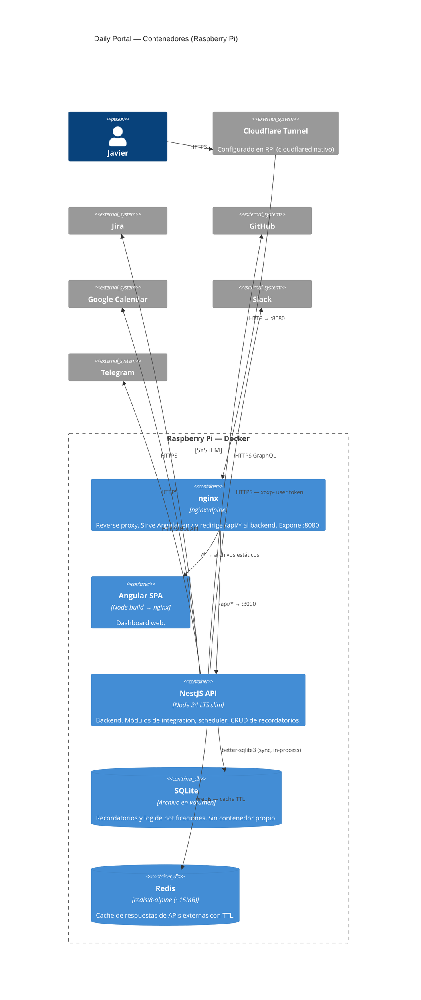
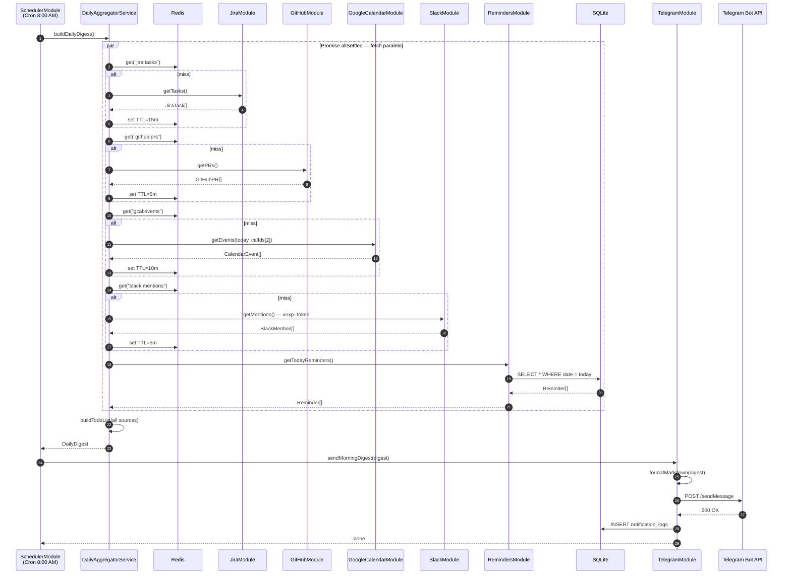
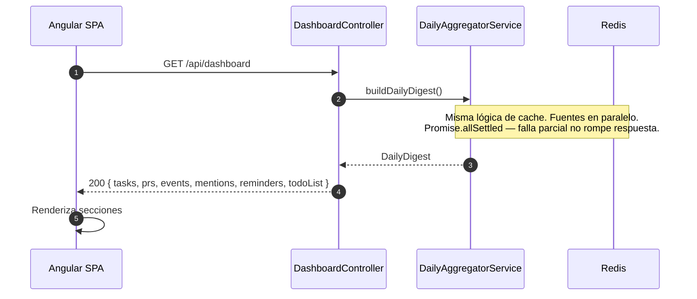
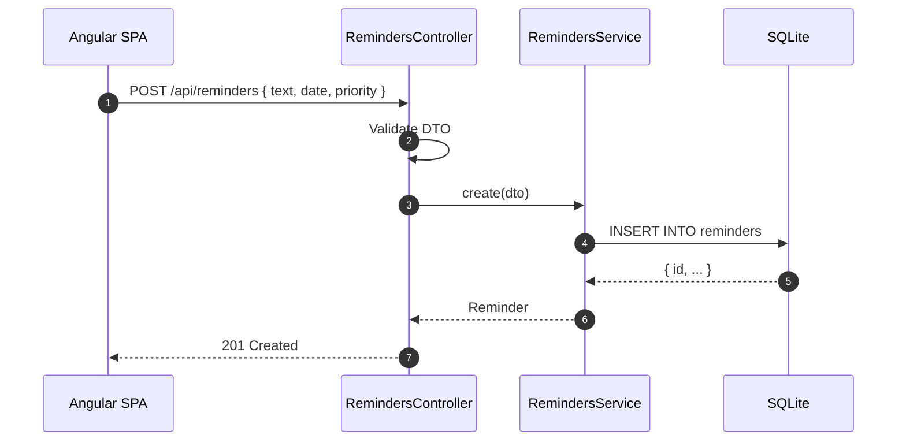
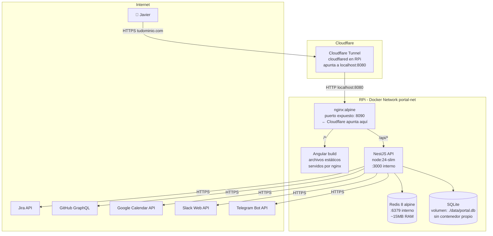
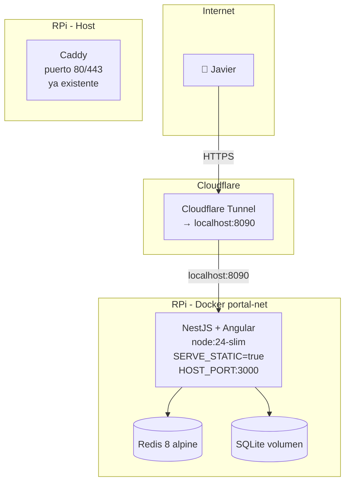
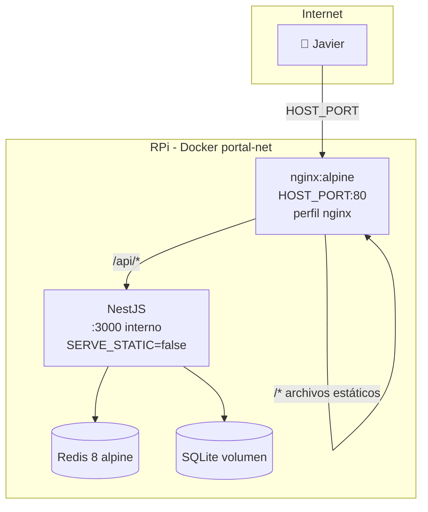

# Daily Portal — Arquitectura del Sistema

> Portal personal de tareas diarias con notificaciones Telegram, integrado con Jira, GitHub, Google Calendar y Slack.
> Desplegado en Raspberry Pi vía Docker. Cloudflare Tunnel expone el puerto **8080**.

---

## Stack

| Capa | Tecnología | Nota |
|---|---|---|
| Frontend | Angular 22+ (standalone components) | |
| Backend | NestJS (Node.js) | |
| Base de datos | SQLite 3 | Archivo en volumen Docker, sin contenedor separado |
| Cache | Redis 8 (alpine) | ~15 MB RAM idle, evita rate limiting en APIs externas |
| Notificaciones | Telegram Bot API | Bot creado con @BotFather |
| Infra | Docker Compose | Sin Compose Watch, Raspberry Pi OS |
| Túnel | Cloudflare Tunnel | Configurado en la RPi; solo expone el puerto **8080** |

### Integraciones activas / inactivas

| Integración | Estado | Auth |
|---|---|---|
| Jira (Tempus) | ✅ Activa | API Token |
| ClickUp (GTC) | ⛔ Desactivada | — |
| GitHub | ✅ Activa | Personal Access Token |
| Google Calendar | ✅ Activa (2 calendarios) | OAuth2 Refresh Token |
| Slack (Tempus) | ✅ Activa | User OAuth Token (`xoxp-`) |
| Telegram | ✅ Activa | Bot Token |

---

## C4 — Nivel 1: Contexto del Sistema



---

## C4 — Nivel 2: Contenedores



---

## C4 — Nivel 3: Componentes (NestJS API)

```mermaid
C4Component
  title NestJS API — Componentes internos

  Container_Boundary(nestjs, "NestJS API") {

    Component(aggregator, "DailyAggregatorService", "Service", "Orquesta todos los providers en paralelo (Promise.allSettled) y construye el DailyDigest.")

    Component(jira_mod, "JiraModule", "Module + Service", "Tareas In Progress / To Do asignadas al usuario.")
    Component(github_mod, "GitHubModule", "Module + Service", "PRs asignados, comentarios nuevos y status checks via GraphQL.")
    Component(gcal_mod, "GoogleCalendarModule", "Module + Service", "Eventos del día de 2 calendarios configurados. OAuth2 con refresh token.")
    Component(slack_mod, "SlackModule", "Module + Service", "Menciones y DMs usando xoxp- User Token. search.messages + conversations.history")
    Component(clickup_mod, "ClickUpModule", "Module + Service ⛔ DISABLED", "Módulo creado pero no registrado en AppModule. Activar añadiéndolo a imports[].")
    Component(reminders_mod, "RemindersModule", "Module + Controller + Service", "CRUD de recordatorios. Persiste en SQLite via better-sqlite3.")
    Component(telegram_mod, "TelegramModule", "Module + Service", "Formatea y envía el digest matutino. node-telegram-bot-api.")
    Component(scheduler_mod, "SchedulerModule", "Module + Cron", "Cron 0 8 * * * (TZ configurable). Llama aggregator → telegram.")
    Component(cache_svc, "CacheService", "Service (ioredis)", "Wrapper de Redis. get/set con TTL por fuente.")
    Component(dashboard_ctrl, "DashboardController", "Controller", "GET /api/dashboard → DailyDigest. GET /api/health.")
    Component(config_mod, "ConfigModule", "Module (@nestjs/config)", "Variables de entorno con validación via Joi.")
  }

  ContainerDb(sqlite, "SQLite (volumen)")
  ContainerDb(redis, "Redis")
  Container(angular, "Angular SPA")

  System_Ext(jira, "Jira API")
  System_Ext(github, "GitHub GraphQL")
  System_Ext(gcal, "Google Calendar API")
  System_Ext(slack, "Slack Web API")
  System_Ext(telegram, "Telegram Bot API")

  Rel(angular, dashboard_ctrl, "GET /api/dashboard")
  Rel(angular, reminders_mod, "GET/POST/PATCH/DELETE /api/reminders")

  Rel(dashboard_ctrl, aggregator, "buildDailyDigest()")
  Rel(scheduler_mod, aggregator, "buildDailyDigest() @ 8 AM")
  Rel(scheduler_mod, telegram_mod, "sendMorningDigest(digest)")

  Rel(aggregator, jira_mod, "getTasks()")
  Rel(aggregator, github_mod, "getPRs()")
  Rel(aggregator, gcal_mod, "getEvents()")
  Rel(aggregator, slack_mod, "getMentions()")
  Rel(aggregator, reminders_mod, "getTodayReminders()")

  Rel(jira_mod, cache_svc, "TTL 15 min")
  Rel(github_mod, cache_svc, "TTL 5 min")
  Rel(gcal_mod, cache_svc, "TTL 10 min")
  Rel(slack_mod, cache_svc, "TTL 5 min")

  Rel(cache_svc, redis, "ioredis get/set")
  Rel(reminders_mod, sqlite, "better-sqlite3 CRUD")
  Rel(telegram_mod, telegram, "sendMessage()")
  Rel(jira_mod, jira, "REST")
  Rel(github_mod, github, "GraphQL")
  Rel(gcal_mod, gcal, "REST")
  Rel(slack_mod, slack, "REST")
```



---

## UML — Secuencia: Flujo matutino (8 AM)



---

## UML — Secuencia: Consulta del dashboard (Angular)



---

## UML — Secuencia: Agregar recordatorio



---

## Diagrama de Infraestructura — Raspberry Pi



> **Cloudflare Tunnel:** en tu configuración nativa de la RPi, apunta el ingress a `http://localhost:8090`. El contenedor `nginx` expone ese puerto hacia el host con `ports: "8090:80"`.

---

## Estructura del Proyecto

```
daily-portal/
├── docker-compose.yml
├── .env.example
├── data/                             # Volumen SQLite — fuera de los contenedores
│   └── portal.db                    # Creado automáticamente en primer boot
│
├── backend/                          # NestJS API
│   ├── Dockerfile
│   ├── package.json
│   ├── tsconfig.json
│   └── src/
│       ├── main.ts
│       ├── app.module.ts
│       │
│       ├── config/
│       │   └── configuration.ts
│       │
│       ├── common/
│       │   ├── cache/
│       │   │   └── cache.service.ts       # ioredis wrapper
│       │   └── types/
│       │       └── daily-digest.types.ts  # Interfaces compartidas
│       │
│       ├── dashboard/
│       │   ├── dashboard.module.ts
│       │   ├── dashboard.controller.ts    # GET /api/dashboard, GET /api/health
│       │   └── daily-aggregator.service.ts
│       │
│       ├── integrations/
│       │   ├── jira/
│       │   │   ├── jira.module.ts
│       │   │   └── jira.service.ts
│       │   ├── github/
│       │   │   ├── github.module.ts
│       │   │   └── github.service.ts      # GraphQL queries
│       │   ├── google-calendar/
│       │   │   ├── gcal.module.ts
│       │   │   └── gcal.service.ts        # OAuth2 + 2 calendarios
│       │   ├── slack/
│       │   │   ├── slack.module.ts
│       │   │   └── slack.service.ts       # User token xoxp-
│       │   └── clickup/                   # ⛔ DISABLED
│       │       ├── clickup.module.ts      # No importado en AppModule
│       │       └── clickup.service.ts
│       │
│       ├── reminders/
│       │   ├── reminders.module.ts
│       │   ├── reminders.controller.ts
│       │   ├── reminders.service.ts
│       │   └── reminders.db.ts            # better-sqlite3 setup
│       │
│       ├── telegram/
│       │   ├── telegram.module.ts
│       │   ├── telegram.service.ts
│       │   └── telegram.formatter.ts
│       │
│       └── scheduler/
│           ├── scheduler.module.ts
│           └── scheduler.service.ts       # @Cron('0 8 * * *')
│
├── frontend/                         # Angular SPA
│   ├── Dockerfile
│   ├── nginx.conf
│   ├── package.json
│   ├── angular.json
│   └── src/
│       ├── main.ts
│       └── app/
│           ├── app.routes.ts
│           ├── core/
│           │   ├── services/
│           │   │   └── dashboard.service.ts
│           │   └── models/
│           │       └── daily-digest.model.ts
│           └── features/
│               ├── dashboard/
│               ├── tasks/
│               ├── prs/
│               ├── calendar/
│               ├── slack/
│               └── reminders/
│
└── db/
    └── schema.sql                    # Script de init para SQLite
```

---

## Modos de despliegue

El portal soporta dos modos controlados por la variable `SERVE_STATIC` y el perfil de Compose:

| Modo | Cuándo usarlo | Cómo levantar |
|---|---|---|
| **Sin nginx** (default) | Ya tienes Caddy u otro proxy (tu caso) | `docker compose up` |
| **Con nginx** | Instalación standalone sin proxy externo | `docker compose --profile nginx up` |

En el modo **sin nginx**, el backend NestJS sirve el frontend Angular directamente via `@nestjs/serve-static`. El contenedor expone el puerto `HOST_PORT` (default 8090) directamente al host. Caddy o Cloudflare Tunnel apuntan a ese puerto.

En el modo **con nginx**, el perfil `nginx` activa un contenedor nginx que sirve los archivos estáticos y hace proxy de `/api/*` al backend. El backend no expone ningún puerto al host.

El build de Angular **siempre va embebido en la imagen del backend** (multi-stage Dockerfile). Esto elimina el contenedor de frontend por completo.

---

## Diagrama de Infraestructura — Raspberry Pi

### Modo sin nginx (default — tu setup con Caddy)



> Puerto expuesto al host: `HOST_PORT` (default 8090). Cloudflare Tunnel o Caddy apuntan ahí.

### Modo con nginx (standalone)



---

## docker-compose.yml

```yaml
version: '3.9'

services:
  redis:
    image: redis:8-alpine
    container_name: portal-redis
    restart: unless-stopped
    command: redis-server --save "" --appendonly no
    networks:
      - portal-net
    healthcheck:
      test: ["CMD", "redis-cli", "ping"]
      interval: 10s
      timeout: 3s
      retries: 5

  backend:
    build:
      context: .
      dockerfile: backend/Dockerfile        # multi-stage: Angular + NestJS
      args:
        BUILDPLATFORM: linux/arm64
    container_name: portal-backend
    restart: unless-stopped
    env_file: .env
    environment:
      # Sin nginx: backend sirve el frontend directamente
      SERVE_STATIC: ${SERVE_STATIC:-true}
    ports:
      # Sin nginx: exponer al host. Con nginx: nginx se encarga, este puerto queda interno.
      - "${HOST_PORT:-8090}:3000"
    volumes:
      - ./data:/app/data
    depends_on:
      redis:
        condition: service_healthy
    networks:
      - portal-net
    healthcheck:
      test: ["CMD-SHELL", "wget -qO- http://localhost:3000/api/health || exit 1"]
      interval: 30s
      timeout: 10s
      retries: 3

  # ── Perfil nginx (opcional) ───────────────────────────────────────────────
  # Activar con: docker compose --profile nginx up
  # Cuando está activo: nginx sirve el frontend y hace proxy al backend.
  # El backend NO debe exponer su puerto al host en este modo.
  nginx:
    profiles: ["nginx"]
    image: nginx:alpine
    container_name: portal-nginx
    restart: unless-stopped
    ports:
      - "${HOST_PORT:-8090}:80"
    volumes:
      - ./nginx/nginx.conf:/etc/nginx/nginx.conf:ro
      - nginx-static:/usr/share/nginx/html:ro  # Angular build desde el backend
    depends_on:
      backend:
        condition: service_healthy
    networks:
      - portal-net

networks:
  portal-net:
    driver: bridge

volumes:
  nginx-static:     # compartido entre backend (escribe) y nginx (lee) en modo nginx
```

> **Sin contenedor de PostgreSQL.** SQLite vive en `./data/portal.db` montado como volumen en el backend.

### Para modo nginx: override de puerto

Cuando usas el perfil `nginx`, el backend **no debe** exponer su puerto al host. Usa un override:

```yaml
# docker-compose.nginx-override.yml
# Uso: docker compose -f docker-compose.yml -f docker-compose.nginx-override.yml --profile nginx up
services:
  backend:
    ports: []                    # quitar el port binding al host
    environment:
      SERVE_STATIC: "false"      # nginx sirve el frontend
```

O más simple: poner `SERVE_STATIC=false` en `.env` cuando uses el perfil nginx.

---

## backend/Dockerfile (multi-stage)

```dockerfile
# ── Stage 1: Build Angular ────────────────────────────────────────────────
FROM node:24-slim AS frontend-builder
WORKDIR /workspace
COPY package*.json ./
COPY frontend/package.json frontend/package.json
COPY backend/package.json backend/package.json
RUN npm ci
COPY frontend frontend
RUN npm run build --workspace frontend

# ── Stage 2: Build NestJS ────────────────────────────────────────────────
FROM node:24-slim AS backend-builder
WORKDIR /workspace
COPY package*.json ./
COPY frontend/package.json frontend/package.json
COPY backend/package.json backend/package.json
RUN npm ci
COPY backend backend
RUN npm run build --workspace backend

# ── Stage 3: Runtime ─────────────────────────────────────────────────────
FROM node:24-slim AS final
ENV NODE_ENV=production
WORKDIR /app

# Dependencias de producción únicamente
COPY package*.json ./
COPY backend/package.json backend/package.json
RUN npm ci --omit=dev --workspace backend && npm cache clean --force

# NestJS compilado
COPY --chown=node:node --from=backend-builder /workspace/backend/dist ./dist

# Angular build embebido — siempre presente en la imagen
# SERVE_STATIC controla si NestJS lo sirve o no
COPY --chown=node:node --from=frontend-builder /workspace/backend/dist/public ./dist/public
COPY --chown=node:node db ./db

# Volumen de datos (SQLite)
RUN mkdir -p /app/data && chown -R node:node /app

# Exponer solo el puerto del proceso Node
EXPOSE 3000

USER node
CMD ["node", "dist/main.js"]

# ── Stage 4: Nginx static frontend profile ───────────────────────────────
FROM nginx:1.29-alpine AS nginx-static
COPY --from=frontend-builder /workspace/backend/dist/public /usr/share/nginx/html
COPY nginx/nginx.conf /etc/nginx/conf.d/default.conf
```

> La imagen final contiene tanto el backend como el frontend. Si no se usa nginx, NestJS sirve los archivos estáticos con `ServeStaticModule`. El perfil nginx construye el target `nginx-static`, que copia el build Angular dentro de `/usr/share/nginx/html`.

---

## .env.example

---

## .env.example

```bash
# ── Modo de despliegue ───────────────────────────
# true  → NestJS sirve Angular directamente (sin nginx, para uso con Caddy/Cloudflare)
# false → Nginx sirve Angular (usar con --profile nginx)
SERVE_STATIC=true
HOST_PORT=8090          # Puerto expuesto al host

# ── SQLite ───────────────────────────────────────
SQLITE_PATH=/app/data/portal.db

# ── Redis ────────────────────────────────────────
REDIS_URL=redis://redis:6379

# ── Telegram ─────────────────────────────────────
TELEGRAM_BOT_TOKEN=          # @BotFather → /newbot
TELEGRAM_CHAT_ID=            # @userinfobot para obtenerlo

# ── Jira (Tempus) ────────────────────────────────
JIRA_BASE_URL=https://tu-org.atlassian.net
JIRA_EMAIL=fjbatresv@gmail.com
JIRA_API_TOKEN=              # id.atlassian.com → Security → API Tokens
JIRA_PROJECT_KEY=            # Ej: TEMP

# ── GitHub ───────────────────────────────────────
GITHUB_TOKEN=                # PAT con scopes: read:user, repo
GITHUB_USERNAME=             # Tu username

# ── Google Calendar ──────────────────────────────
GOOGLE_CLIENT_ID=
GOOGLE_CLIENT_SECRET=
GOOGLE_REFRESH_TOKEN=        # OAuth2 Playground — scope: calendar.readonly
GOOGLE_CALENDAR_IDS=primary,calendario-tempus@group.calendar.google.com

# ── Slack (User Token — sin bot) ─────────────────
# Crear una Slack App en api.slack.com/apps
# OAuth Scopes (User Token): search:read, channels:history, im:history, users:read
# Instalar la app en tu workspace → copiar "User OAuth Token" (xoxp-...)
SLACK_USER_TOKEN=            # xoxp-...
SLACK_USER_ID=               # Tu Slack User ID (Settings → Profile → ...)

# ── Scheduler ────────────────────────────────────
MORNING_DIGEST_CRON=0 8 * * *
TZ=America/Guatemala
```

---

## db/schema.sql (SQLite)

```sql
CREATE TABLE IF NOT EXISTS reminders (
  id          TEXT PRIMARY KEY DEFAULT (lower(hex(randomblob(16)))),
  text        TEXT NOT NULL,
  date        TEXT NOT NULL,           -- ISO date YYYY-MM-DD
  priority    TEXT DEFAULT 'medium'
                CHECK (priority IN ('low','medium','high')),
  completed   INTEGER DEFAULT 0,
  created_at  TEXT DEFAULT (datetime('now')),
  updated_at  TEXT DEFAULT (datetime('now'))
);

CREATE TABLE IF NOT EXISTS notification_logs (
  id          TEXT PRIMARY KEY DEFAULT (lower(hex(randomblob(16)))),
  sent_at     TEXT DEFAULT (datetime('now')),
  status      TEXT NOT NULL CHECK (status IN ('success','error')),
  error_msg   TEXT
);

CREATE INDEX IF NOT EXISTS idx_reminders_date ON reminders(date);
CREATE INDEX IF NOT EXISTS idx_logs_sent ON notification_logs(sent_at DESC);
```

---

## frontend/nginx.conf

```nginx
events {}

http {
  include       /etc/nginx/mime.types;
  default_type  application/octet-stream;

  server {
    listen 80;

    # Angular SPA
    location / {
      root   /usr/share/nginx/html;
      index  index.html;
      try_files $uri $uri/ /index.html;  # SPA routing
    }

    # Proxy al backend NestJS
    location /api/ {
      proxy_pass         http://backend:3000;
      proxy_http_version 1.1;
      proxy_set_header   Host $host;
      proxy_set_header   X-Real-IP $remote_addr;
    }
  }
}
```

---

## Notas de Slack — User Token sin Bot

Slack permite leer mensajes y menciones usando un **User OAuth Token** (`xoxp-`) sin necesidad de un bot en el canal. El flujo es:

1. Ir a [api.slack.com/apps](https://api.slack.com/apps) → **Create New App** → From scratch
2. En **OAuth & Permissions** → **User Token Scopes**, agregar:
   - `search:read` — buscar mensajes con `@javier`
   - `channels:history` — leer historial de canales
   - `im:history` — leer DMs
   - `users:read` — resolver user IDs a nombres
3. **Install to Workspace** → copiar el **User OAuth Token** (`xoxp-...`)
4. No hace falta invitar ningún bot a ningún canal

El servicio usará `search.messages` con query `to:@me` para obtener menciones recientes.

---

## Notas del Homelab (Raspberry Pi)

**Entorno detectado:** Debian 13 (trixie) · aarch64 · Docker 29.2.1 · Compose v5.1.0

### Puertos ocupados — no usar

| Puerto | Servicio detectado |
|---|---|
| 80 | Caddy (reverse proxy) |
| 2019 | Caddy admin API |
| 3000, 3001 | Servicios existentes |
| 5984 | CouchDB |
| 8080, 8081 | Servicios existentes |
| 8123 | Home Assistant |
| 8888 | Servicio existente |
| 53 | DNS (Pi-hole / AdGuard) |
| 139, 445 | Samba |
| 22 | SSH |

**Puerto asignado al portal: `8090`** (libre). Configurar en Cloudflare Tunnel → `http://localhost:8090`.

### Docker sin sudo
El usuario actual no está en el grupo `docker`. Para evitar usar `sudo` en cada comando:
```bash
sudo usermod -aG docker $USER
# Cerrar sesión y volver a entrar para que tome efecto
# Verificar:
docker ps
```

### Construcción ARM64
Las imágenes se construyen para `linux/arm64` (aarch64). Si construyes desde otra máquina (x86), usa:
```bash
docker buildx build --platform linux/arm64 ...
# O directamente en la RPi donde la arquitectura ya es la correcta
```

---

## Guía de inicio rápido

### 1. Telegram Bot
```bash
# En Telegram:
# 1. Hablar con @BotFather → /newbot
# 2. Copiar el token → TELEGRAM_BOT_TOKEN en .env
# 3. Hablar con @userinfobot → copiar tu ID → TELEGRAM_CHAT_ID
```

### 2. Google Calendar OAuth2
```
1. console.cloud.google.com → Nuevo proyecto
2. APIs & Services → Enable → Google Calendar API
3. Credentials → Create → OAuth 2.0 Client ID → Desktop App
4. Descargar client_secret.json
5. Ir a: https://developers.google.com/oauthplayground
   → Gear icon → Use your own OAuth credentials → pegar Client ID y Secret
   → Scope: https://www.googleapis.com/auth/calendar.readonly
   → Authorize → Exchange → copiar refresh_token
```

### 3. Levantar en la RPi
```bash
# Clonar el repo en la RPi
git clone <repo> daily-portal && cd daily-portal

# Configurar variables
cp .env.example .env
nano .env   # completar tokens

# Crear carpeta de datos
mkdir -p data

# Construir y levantar (primera vez puede tardar en ARM)
docker compose up -d --build

# Ver logs
docker compose logs -f backend

# El cron corre a las 8 AM automáticamente
# Cloudflare ya apunta a localhost:8080 — el portal ya es accesible
```

### 4. Formato del mensaje Telegram (8 AM)

```
📋 *Daily Digest — Lunes 29 Jun*

📅 *Calendario* (3 eventos)
• 09:00 Stand-up Tempus
• 11:00 Design Review
• 15:00 1:1 con manager

🎯 *Tareas Jira* (2 activas)
• [TEMP-123] Implementar autenticación OAuth
• [TEMP-456] Fix bug módulo de pagos

🔀 *PRs que requieren atención* (2)
• ⚠️ [api-gateway] Comentarios nuevos
• 🔴 [frontend-app] Checks fallando

💬 *Slack Tempus* (3 menciones)
• #backend: "¿cuándo estará el endpoint?"

📌 *Recordatorios de hoy* (1)
• Enviar propuesta técnica

✅ *TODO del día*
1. Responder comentarios en PR api-gateway
2. Atender mención en #backend
3. Continuar TEMP-123
4. Preparar material Design Review 11:00
```
